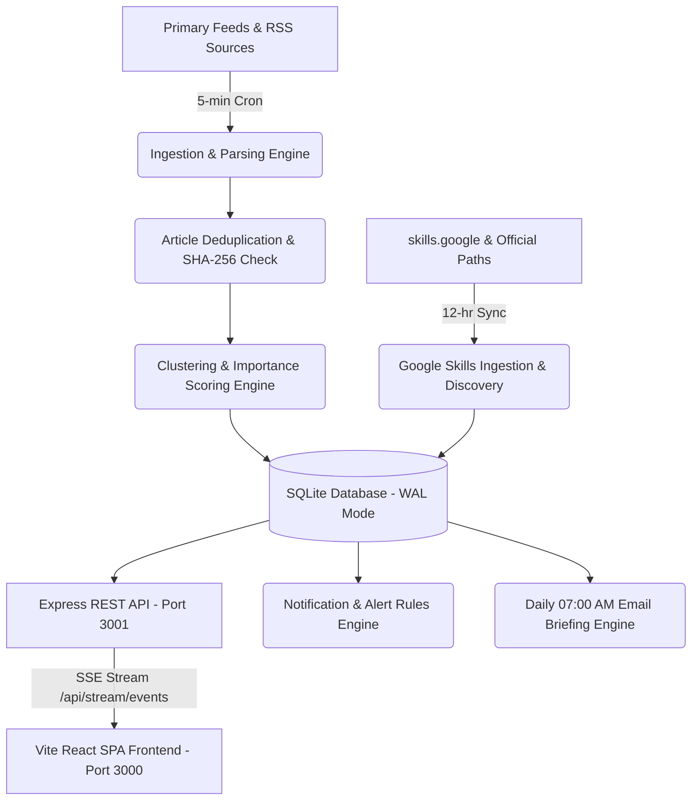

# 🌐 AI Intelligence Radar & Skill Recommendation Platform

> **Real-time AI News Clustering, Topic Intelligence Channels, Google Skills Learning Engine, and Real-time SSE Alert Streaming.**

[](https://www.typescriptlang.org/)
[](https://react.dev/)
[](https://expressjs.com/)
[](https://www.sqlite.org/)
[](LICENSE)

---

## 🚀 Key Features

### 1. 📰 Multi-Source News Ingestion & Clustering
* **20+ Tier-1 AI Sources**: Continuously ingests and deduplicates articles from OpenAI, Google DeepMind, Anthropic, Meta AI, NVIDIA, arXiv (cs.AI), Hugging Face, TechCrunch, and more.
* **Intelligent TF-IDF Clustering**: Groups redundant reporting into unified **Story Clusters** scored for **Importance** ($0-100$), **Credibility** ($0.0-1.0$), and **Confidence**.
* **Early Signals Watcher**: Detects emerging preprint research papers, open weights drops, and unverified pre-announcements before mainstream coverage.

### 2. 🎓 Google Skills Intelligence & Learning Engine
* **Automated Catalog Discovery & Sync**: Synchronizes official learning pathways from `skills.google`, `cloud.google.com`, `deepmind.google`, and `developers.google.com`.
* **Multi-Factor Recommendation Algorithm**:
  $$\text{Score} = 0.30 \cdot \text{Momentum} + 0.20 \cdot \text{Interest} + 0.20 \cdot \text{Gap} + 0.15 \cdot \text{Prerequisites} + 0.15 \cdot \text{Freshness}$$
* **Explainable AI Recommendations**: Every recommendation explains *why* it is suggested with momentum metrics, gap bridging rationale, and verified badge credentials.

### 3. 🎯 Interactive Skill Gap Radar & Action Plan
* **Multi-Axial SVG Radar Visualizer**: Visualizes the user's competency polygon directly overlaid with real-time market demand.
* **1-Click Competency Adjuster**: Toggle proficiencies (`Beginner`, `Mid`, `Pro`) with animated polygon transitions and tailored Google learning pathways.

### 4. ⚡ Real-Time SSE Live Alert Stream & Toast System
* **Server-Sent Events (`/api/stream/events`)**: Unidirectional real-time stream broadcasting `BREAKING_NEWS`, `NEW_CLUSTER`, and `GOOGLE_SKILL_SYNCED` directly to connected browsers with automatic reconnection.
* **Floating Live Toasts**: Interactive toasts for instant inspection of high-priority intelligence events.

### 5. 📧 Executive Briefings & Topic Intelligence
* **Daily 07:00 AM Automated Briefing**: Executive HTML briefing dispatched via SMTP covering the top 5 stories, market themes, and recommended skills.
* **Topic Taxonomy**: 20 topic intelligence channels with custom keyword weights, entity tracking (companies, models), and timeline diffs.

---

## 🛠️ Architecture & Tech Stack



* **Frontend**: React 19, TypeScript, Tailwind CSS, Lucide Icons, Native SVG Radar Visualizer.
* **Backend**: Node.js (v22+), Express 4, TypeScript, Node SQLite (`node:sqlite` in WAL mode).
* **AI Intelligence**: Google Gemini 2.5 Flash (`@google/genai`) with automatic multi-model fallback.
* **Streaming**: Server-Sent Events (SSE) with heartbeat keep-alives.

---

## 🏁 Quickstart & Installation

### Prerequisites
* **Node.js**: `v20.0+` (Recommended `v22+` / `v24+`)
* **npm**: `v9.0+`

### 1. Clone the Repository
```bash
git clone https://github.com/DSAvinash/ai-news.git
cd ai-news
```

### 2. Install Dependencies
```bash
npm install
```

### 3. Configure Environment Variables
Copy `.env.example` to `.env` and set your Gemini API key and SMTP credentials:
```bash
cp .env.example .env
```

### 4. Run Development Server
```bash
npm run dev
```
* **Frontend**: [http://localhost:3000/](http://localhost:3000/)
* **Backend API**: [http://127.0.0.1:3001/](http://127.0.0.1:3001/)

### 5. Run Automated Smoke Tests
```bash
npm run test
```

### 6. Production Build & Start
```bash
npm run build
npm start
```

---

## 📄 License
This project is licensed under the MIT License.
